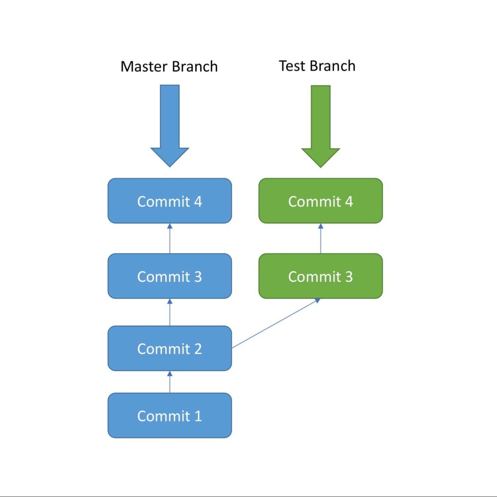
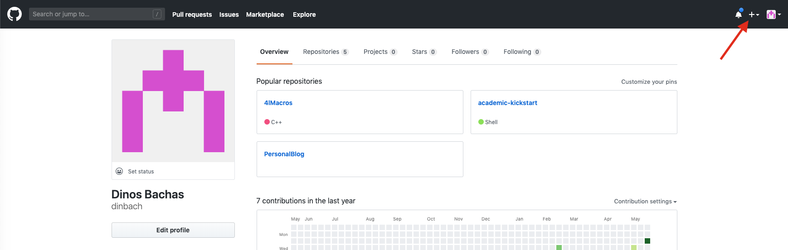
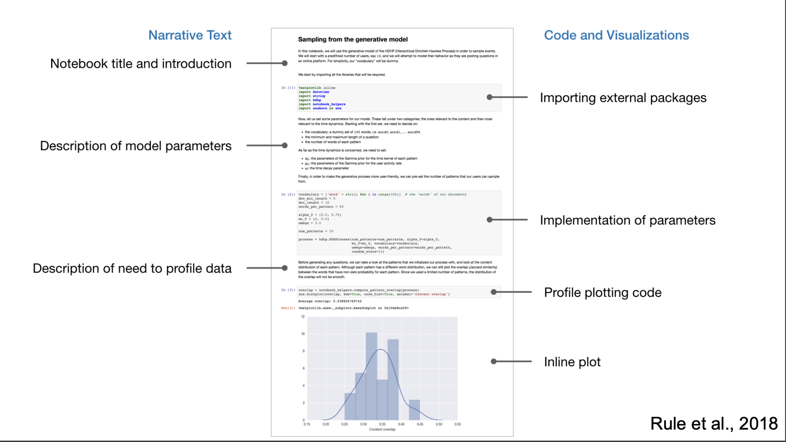

layout: true

.footer[
- Lecture 1
- Hands-on ML
]

---

class: title, no-footer

# Hands-on Machine Learning
## Lecture 1

---

# About the course

The aim of this course is to give an introduction to tools for using Machine Learning on simple problems.

All meterial will eventually appear on [My Page](https://dinosbachasblog.netlify.com/talks)

Don't hesite to contact me on any questions/suggestions/corrections you might have
- Contact details [dinos.bachas@cern.ch](mailto:dinos.bachas@cern.ch)

Today we will have a 3h session
- Need to define the date/time for next courses

---
class: roomy
# Pre-requisites 

The following check-list is recommended to have before you start:

- A laptop with a unix based OS or at least `ssh` connection capability 
- Account at the local pc cluster
- Some previous knownledge of python and shell scripting
- A connection to the internet

---

# Topics

- The **Ana(mini)conda** package managers
	- Setting up an environment for development

--
- **Jupyter** notebooks and **Git**

--
- Basics of **Python**, Numpy and Pandas

--
- Preparing the inputs for ML libraries. Data formats, I/O, feature scaling.

--
- Building an NN model in Keras. Feed-Forward Network Setup, Cost function, Gradient descent, hyperparameter optimization.

--
- The problem of overfitting and regularization

--
- About performance metrics; Loss, Accuracy, ROC, AUC and all that

--
- Visualization of results and related software tools

---

class: title,smokescreen

# The ana(mini)conda package and environment manager

---

class: compact

# Why we need a package and environment manager?

Huge number of packages and ML related libraries to install

Need for:
- A package manager that will **download** from the proper repository the tools you need
- A environment setup manager that will **load all libraries** needed for ML code development
- A manager to **install** everything taking care of dependencies
- Build a kind of **virtual machine**, where you can install whatever packages you need keeping your machine's default setup and configuration intact

--

**Conda** is both a packaging tool/installer and virtual environment manager
- Handles library dependencies outside of the Python packages as well as the Python packages themselves

---

class: compact

# The Anaconda and Miniconda package managers

Both Anaconda and Miniconda uses Conda as the package manager. 

Miniconda only comes with the package management system not with a bundle of pre-installed packages like Anaconda. Once Conda is installed, you can then install whatever package you need from scratch along with any desired version of Python.
Anaconda comes with a desktop app (optional).

They allow to:
- Collect data from files, databases, and data lakes
- Manage environments with Conda (all package dependencies are taken care of at the time of download)
- Share, collaborate on, and reproduce projects

[https://www.anaconda.com/](https://www.anaconda.com/)<br>
[https://conda.io/docs/](https://conda.io/docs/)

---
class: col-2
# Anaconda or Miniconda?

Choose Anaconda if you:

- Prefer having Python and 720+ packages automatically installed at once
- Have the time and disk space (a few minutes and 3 GB)
- Don’t want to install each of the packages you want to use individually.

<br>
Choose Miniconda if you:

- Know what package(s) you need
- Do not have time or disk space to install over 720+ packages 
- Just want fast access to Python and the conda commands, and prefer to sorting out the other packages later.

---
class: compact
# Installing Miniconda

Login to one of the ***wn*** machines on the Lecce cluster:
```Bash
ssh kbachas@wn-20.le.infn.it -Y -X
```

Download the Miniconda installer either from the webpage:
[https://docs.conda.io/en/latest/miniconda.html](https://docs.conda.io/en/latest/miniconda.html)

or typing in your terminal:
```Bash
wget https://repo.anaconda.com/miniconda/Miniconda3-latest-Linux-x86_64.sh
```


Install
```Bash
bash Miniconda3-latest-Linux-x86_64.sh
```

---

class: compact


- Accept the license terms by typing `yes` when prompted

- Press `[ENTER]` to install miniconda3 under your `$HOME` directory

- When prompt:

> Do you wish the installer to initialize Miniconda3
by running conda init? [yes|no]

Answer yes

- After the conda installation is complete, close the terminal and
reopen it

- Type `conda list`. You should now get installed default packages. If yes, you are ready to start creating your environment for development

---
class: compact, no-footer
# Miniconda useful commands

Create a new environment named `AIenvPy3` or whatever name you like
```Bash
conda create --name AIenvPy3
```
To activate this environment, use:
```Bash
conda activate AIenvPy3
```
This will now give you a characteristic (AIenvPy3) in front of your prompt. To deactivate an active environment, use:
```Bash
conda deactivate
```

To delete an entire environment and all packages installed for this env use:
```Bash
conda remove --name AIenvPy3 --all
```

---
class: compact, no-footer

# Sharing Environments
Make an exact copy of an environment<br>
`conda create --clone AIenvPy3 --name AIenvPy3_copy`

Export an environment to a YAML file that can be read on Windows, macOS, and Linux<br>
`conda env export --name AIenvPy3 > envname.yml`

Create an environment from YAML file<br>
`conda env create --file envname.yml`

Export an environment with exact package versions for one OS<br>
`conda list --explicit > pkgs.txt`

Create an environment based on exact package versions<br>
`conda create --name NEWENV --file pkgs.txt`

---
class: compact, no-footer
# Using Packages and Channels

Install package from a specific channel<br>
`conda install conda-forge::PKGNAME`

Install a package by exact version number (3.1.4)<br>
`conda install PKGNAME==3.1.4`

Add a channel to your Conda configuration<br>
`conda config --add channels CHANNELNAME`

Example:
> conda install -c conda-forge jupyterlab

---

# Lets install some packages
```Bash
conda install -c conda-forge jupyterlab
conda install -c conda-forge root
conda install keras scikit-learn pandas numpy theano matplotlib seaborn pydot colorama
pip install uproot
pip install scikit-hep
```

If you have these installed without any problems then you are ready to go!

---

class: title,smokescreen
# Versioning system
## Git, GitHub and all that...

---

class: compact

# Git: what it is, and how to use it

Git is an Open Source Distributed Version Control System
- A system that keeps records of your changes
- Allows for collaborative development
- Allows you to know who made changes and when
- Allows you to revert any change and go back to previous state

What is version control?
- Users keep entire code and history on their location machines
	- Can make changes without internet access 
	- Upload and download changes from remote server

---

class: roomy
# Git: what it is?

Git is based on commits (i.e snapshots of your code):
- Records what all(or some) your files look like at a given point in time
- Have the ability to go back to visit any snapshot
- A commit stores information about how the files changed since last time
- Keeps a reference to the commit that came before it
- Stores a hash code name (unique ID)

---

class: img-right, compact


# Repositories
- Is a collection of all the files and the history of those files &rarr; your commits
- **Can live on a local machine or on a remote server** ([GitHub](https://github.com/), [GitLab](https://about.gitlab.com/), [Bitbucket](https://bitbucket.org), etc)

--

Basic actions
- **Clone**: Copying a repository from a remote server 
- **Pull**: Downloading commits that don’t exist on your machine from a remote repository
- **Push**: Adding your local changes to the remote repository

---

class: img-right, compact



# Branches

A branch is a pointer to the latest commit in the Git repository.

The main branch in a project is called the **master branch**

All commits in git live on some branch, by default they go to the **master** branch

Branches are used to develop features isolated from each other. They can be used for development and then can be merged back to the master branch upon completion.


---
class: roomy
# The Remote Git Repository

By default work happens in the local repository. However if you want to collaborate on a project or bookkeep your work you will push the code into a remote repository. 

Once the code is in the remote repository, other developers can see and modify that code.

--

Go to https://github.com/ and create an account. Accounts are free for public repositories, but now also for private repositories.

---
class: compact
#Create a local git repository and add files

```sh
mkdir myproject; cd myproject
```

To initialize a git repository in the root of the folder, run the git init command:<br>
```sh
git init
```

Go ahead and add a new file to the project, using any text editor you like or running a touch command.
```Bash
touch README.md
touch info.txt
git status
```
Git will notice that changes have been made inside the repo. But, won't officially keep track of the file unless you tell it to.

---
# Put files into staging and create a commit
To add a file to a commit, you first need to add it to the **staging** environment.

**Staging** is a way to tell Git which files you intent to put into a commit.
```Bash
git add <filename> 
```

--

And then commit adding a message about it with `-m`
```Bash
git commit -m "Adding README.md and info.txt"
```
---

# Create a new repository on GitHub
To create a new repo on GitHub, log in and go to the GitHub home page. You should see a green '+ New repository' button:



---
# Create a new repository on GitHub
Name your new repository as you want and click on `Create repository`


---
class: compact

# Connect your local repository to the remote
To push your existing repository from the command line to the remote repository on Github do **(Don't forget to change the names!)**
```Bash
cd myproject
git remote add origin https://github.com/dinbach/ML_Lecture1.git
git push -u origin master
```
if that fails try:
```Bash
git remote set-url origin git@github.com:dinbach/ML_Lecture1.git
git push -u origin master
```

Now you should be able to navigate online and see your files
---

class: img-caption


Your newly created Repository on Github!

---
class: compact

# Create a new branch
When you create a new branch, Git keeps track of which commit your branch 'branched' off of, so it knows the history behind all the files. 

Let's say you are on the master branch and want to create a new branch to develop your code. 
```Bash
git checkout -b DevNewCode
```

Use the `git branch` command to confirm that your branch was created

Now edit one of your files and redo add, commit and upload to Github!
```Bash
git add .
git commit -m "Update README"
git push origin DevNewCode
```
---
class: img-caption


Your branch should be online now!

---
# Cloning a repository

You can download your or a collaborator's directory by **Cloning**. Get out of the `myproject` directory and simply do:
```Bash
git clone git@github.com:dinbach/ML_Lecture1.git
```
This will get ML_Lecture1 repository from the server and you are now ready to edit it locally!


---
class: title, smokescreen

# Jupyter Notebooks

---

# The Jupyter Notebook

[https://jupyter.org/](https://jupyter.org/)

The **Jupyter Notebook** is an open-source web application that allows you to create and share documents that contain live code, equations, visualizations and narrative text. 

It is incredibly powerful tool for interactive development and presenting data science projects. A notebook integrates code and its output into a single document that combines plots, text, equations and rich media

It supports over 40 programming languages!

---



---

class: roomy

# The Jupyter Notebook

We will be using Jupyter Notebooks a lot throughout this course.

You can start a Jupyter Notebook session under the Conda environment we created before.

Lets start now!

```Bash
jupyter notebook
```


