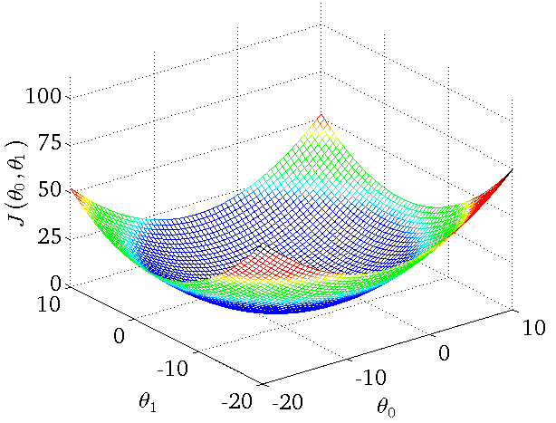

class: title, smokescreen, shelf, no-footer
background-image: url(/img/maria3.png)

# Hands-on Machine Learning
## Lecture 3

---

# What is Machine Learning?

Arthur Samuel (1959)
> Field of study that gives computers the ability to learn without being explicitly programmed.

Tom Mitchell (1998)
>A computer program is said to learn from experience E with respect to some task T and some performance measure P, if its performance on T, as measured by P, improves with experience E.
---
class: col-2,roomy

# Where is ML used?


- Speech and handwriting recognition
- Object recognition and computer vision
- Data Science

--
- Fraud detection
- Spam and virus detection
- Search engines

--
- Financial market analysis
- Advertising

--
- Medical diagnosis
- Robotics control
- Automation: energy usage, systems control, video games, self-driving cars

--
- Physics 

---

# Categories of ML

- .color-dodgerblue[Classification]
	- Goal: Predict results in discrete categories
	- \\( y = [0, 1] \\) for binary classification
    - \\( y = [c_1, c_2,...,c_n] \\) for multi-class classification 
    	- represent with "one-hot-vector" \\( y_i = [0, 0,..., 1 ,...,0]\\), where  `k`-element is 1 and all others zero for class \\( c_k \\)

--

- .color-forestgreen[Regression]
	- Goal: Predict a numeric value within a continuous output, meaning that we are trying to map input variables to some continuous function
	- \\( y = \text{Real Numbers} \\)

---
class: roomy
# Categories of ML

- .color-orangered[Cluster Analysis]
	- Goal: Organize similar items into groups
	- \\( D = [D_1 ∪ D_2 ∪ D_3 ... ∪ D_k] \\)

--
- .color-goldenrod[Dimensionality reduction]
	- Goal: Reducing the number of variables under consideration, by obtaining a set of principal variables. Find a low dimensional (less complex) representation of the data with a mapping \\( Z = h(x) \\)

---

# Learning techniques
.color-dodgerblue[**Learning**: estimate statistical model from data]

- .color-forestgreen[**Supervised**]
	- The target (what model is predicting) is provided, i.e we know the relationship between the input and the output
	- The data is "Labeled"
		- Regression
		- Classification
--

- .color-orangered[**Unsupervised**]
	- The target is unknown or unavailable
	- The data is "Unlabeled"
		- Cluster analysis 
		- Dimensionality reduction

---

class: img-right, compact

# Terminology 


.color-forestgreen[**Sample**]: Row, event, record, instance...all mean the same thing!

.color-orangered[**Variable**]: Columns, Features, dimension, attribute...all mean the same thing!
  - Variables' data types: Numeric, categorical, strings, ...

\\(x_i\\) : .color-deepskyblue[**input**] variables<br>
\\(y_i\\) : .color-navy[**output**] or target variable<br>
\\((x_i, y_i)\\) : training example<br>
\\( \\{ (x_i, y_i); i = 1, . . .,m \\} \\) : .color-darkorchid[**training set**] of `m` examples

---

class: img-right

# Supervised Learning - How does it work?


Our goal is, given a training set, to learn a function .color-darkorchid[**`h`**] :  \\(X \rightarrow Y\\) so that .color-darkorchid[**`h(x)`**] is a good predictor for the corresponding value of .color-limegreen[`y`]. 

.color-darkorchid[**`h(x)`**]  is called hypothesis (model)

--

When .color-limegreen[`y`] is continuous, the learning problem is a .color-orange[regression] problem.

---

class: img-right

# Supervised Learning - How does it work?


Our goal is, given a training set, to learn a function .color-darkorchid[**`h`**] :  \\(X \rightarrow Y\\) so that .color-darkorchid[**`h(x)`**] is a good predictor for the corresponding value of .color-limegreen[`y`]. 

.color-darkorchid[**`h(x)`**]  is called hypothesis (model)

When .color-limegreen[`y`] can take on 2 discrete values the learning problem is a .color-orange[binary classification] problem.

---

class: img-right

# Supervised Learning - How does it work?


Our goal is, given a training set, to learn a function .color-darkorchid[**`h`**] :  \\(X \rightarrow Y\\) so that .color-darkorchid[**`h(x)`**] is a good predictor for the corresponding value of .color-limegreen[`y`]. 

.color-darkorchid[**`h(x)`**]  is called hypothesis (model)

When .color-limegreen[`y`] can take on more than 2 discrete values the learning problem is a .color-orange[multi-class classification] problem.

---

class: img-right

# Supervised Learning - Example of a model


Lets say you have data of a movie ranking in IMDB and the views of this movie per month on Netflix 

Say you work for Netflix and want to predict the views of a movie if shown with ranking 7.8

---

class: img-right

# Supervised Learning - Example of a model


Lets say you have data of a movie ranking in IMDB and the views of this movie per month on Netflix 

Say you work for Netflix and want to predict the views of a movie if shown with ranking 7.8

A learning algorithm might want to put a .color-forestgreen[straight line] through the data

---

class: img-right

# Supervised Learning - Example of a model


Lets say you have data of a movie ranking in IMDB and the views of this movie per month on Netflix 

Say you work for Netflix and want to predict the views of a movie if shown with ranking 7.8

A learning algorithm might want to put a straight line through the data

A better algorithm might fit a .color-forestgreen[quadratic function], or a .color-forestgreen[second-order polynomial] to this data

---

# Linear regression


Say you have the training set of Movies Scores on IMDB and the millions of views on Netflix

Hypothesis: \\(h(x) = \theta_0 + \theta_1 x \\)<br>
\\( \theta_i \\): parameters

.color-red[Question]: how can we best select the \\( \theta_0, \theta_1 \\) ?

--> Typical minimization problem

---

class: img-right, compact

# Cost function



.color-darkgreen[**Answer**]: Choose parameters \\( \theta_0, \theta_1 \\) so that our prediction .color-darkorchid[**`h(x)`**] is as close as possible to the truth values .color-limegreen[`y`]. 
We measure the accuracy of our hypothesis using a cost function.

Define cost function:  
\\[ 
J(\theta) = \frac{1}{2m} \sum_{i=0}^{m} (h(x_i) - y_i)^2 
\\]
Cost function for linear regression is convex

Goal: minimize \\( J(\theta_0,\theta_1) \\)
---

class: compact
# Cost Functions


---
class: compact
# Supervised Learning - Building an ML model


Model parameters are adjusted during model training to change input-output mapping.

- Design function with adjustable parameters
- Design a Loss function
- Find best parameters which minimize loss

---
class: compact
# Supervised Learning - Building an ML model


Model parameters are adjusted during model training to change input-output mapping

- Use a labeled training-set to compute loss
- Adjust parameters to reduce loss function
- Repeat until parameters stabilize
- Estimate final performance on test-set


---
class: img-right,compact

# Classification with linear regression??


Training set for a classification task of Signal or Background process wrt to the momentum of a particle. 

Only two possible values, zero or one.

Linear regression tries to fit the straight line to the data 

\\( h(x) = \theta ^T x \\)


For predictions threshold the classifier outputs at 0.5 
- \\( h(x) < 0.5 \\) is background (y=0)
- \\( h(x) > 0.5 \\) is signal (y=1)


---
class: img-right,compact

# Classification with linear regression??


Adding an event far away illustrates why linear regression cannot work for classification problems

Linear regression tries to fit .color-limegreen[another line] to the data but now for thresholds at 0.5 different events are tagged as S or B

Also it is odd that even though \\( y= [0,1] \\) , the algorithm can output values \\(h(x)>1\\) or \\(h(x)<0\\)

**Need another function!**

---

class: img-right, compact
# Classification with Sigmoid function


Use sigmoid function:
\\[ h_{\theta}(x) = g( \theta ^T x) \\]
\\[ z = \theta ^T x\\]
\\[ g(z) = \frac{1}{1+e^{-z} } \\]

g(z) maps any real number to (0, 1),
- Useful for transforming an arbitrary-valued function into a function better suited for classification.
- \\( h_\theta(x) \\) gives probability that output is 1
  - \\( h_\theta(x) = P(y=1 | x;\theta) = 1 - P(y=0 | x;\theta) \\)
  - \\( P(y=0|x;θ)+P(y=1|x;θ)=1 \\)


---
class: compact
# Gradient descent


We need an algorithm for minimizing the cost function 

Gradient descent: 
>Repeat until convergence steps proportional to the negative of the gradient of the function at the current point and update parameters with the rule:
\\[
\theta_j := \theta_j - \alpha \frac{\partial}{\partial \theta_j} J(\theta_0,\theta_1,...,\theta_n)
\\]

- j=0,...,n represents the feature index number
- \\(\alpha\\) is the .color-red[learning rate] and controls how big a step should be in the minimization process. If too small, minimization is slow. If too big gradient decent can overshoot the minimum or diverge
- As we approach local minimum, the derivative automatically gets smaller --> gradient descent takes smaller steps. 

---

class: compact
# Stochastic Gradient descent


Gradient descent is computationally costly (since we compute gradient over full training set)

.color-deepskyblue[Stochastic gradient descent:]
- Compute gradient on one event at a time (in practice a small batch)
- Noisy estimates average out
- Stochastic behavior can allow “jumping” out of bad critical points
- Scales well with dataset and model size
- But can have some convergence difficulties
- Improvements include: Momentum, RMSprop, AdaGrad


---
class: compact

# (Deep) Neural networks


- The fundamental building block of Deep Learning is the Perceptron which is a single neuron in a Neural Network.
- Given a finite set of m inputs, each input is multiplied by a weight \\( \theta_1\\) to \\( \theta_m\\) then we sum up the weighted combination of inputs, 
- Finally pass them through a non-linear activation function --> produces the output Y
- A neural network consists of putting together many neurons in such a way that output of a neuron can be the input of another.

---

class: compact

# Types of activation functions


---

class:compact
# Feature scaling

Standardization of a dataset is a common requirement for many machine learning estimators: 
- they might behave badly if the individual feature do not more or less look like standard normally distributed data

We can speed up gradient descent by having input values in roughly the same range. 
- Minimization of the cost function will descend quickly on small ranges and slowly on large ranges, 
- Will oscillate inefficiently down to the optimum when the variables are very uneven.


 This can be done using the StandardScaler module from the scikit-learn (http://scikit-learn.org) library.
---

# Feature scaling - Examples

1. Standardization (or Z-score normalization) features will have the properties of a Gaussian distribution with \\(\mu = 0, \sigma =1\\)
\\[
z = x_{norm} = \frac{x - \mu}{\sigma}
\\]
where \\(\mu\\) is the mean and \\( \sigma\\) is the standard deviation

2. Min-max normalization works better if the distribution is not Gaussian or the standard deviation is very small
\\[
x_{\text{norm}} = \frac{x - xmin}{xmax - xmin}
\\]


---


class: compact
# Train/Test of a model - Data allocation


Split dataset into multiple parts

--

.color-deepskyblue[Training set]: Used to fit model parameters

--

.color-darkorange[Validation set]: Used to check performance on independent data and tune hyper parameters

--

.color-limegreen[Test set]:
- final evaluation of performance after all hyper-parameters fixed
- Needed since we tune, or “peek”, performance with validation set

---

# What is Keras ?


https://keras.io/

Python library to build and train neural networks.

Python wrapper around multiple numerical computation libaries, e.g., TensorFlow, Theano,...

Very abstract and modular. Hides most of the low-level configuration sacrificing little functionality for much easier user interface

Officially supported from Google

---

# Building NNs in Keras

The core data structure of Keras is a model, a way to organize layers. The simplest type of model is the .color-orangered[Sequential] model, a linear stack of layers. 

```Python
from keras.models import Sequential
model = Sequential()
```

For more complex architectures, you should use the Keras functional API, which allows to build arbitrary graphs of layers.

---

# Building NNs in Keras: Adding layers

Adding more layers with `.add()`
```Python
from keras.layers import Dense
model.add(Dense(units=64, activation='relu', input_dim=100))
model.add(Dense(units=10, activation='softmax'))
```
- `units`: Number of nodes 
- `activation` : Activation function to use for that particular layer
- `input_dim` : Number of input features

---

class: compact

# Building NNs in Keras: Compiling the model

"Compile" the model (i.e means to configure it actually and use the backend for the numerical computations)
```Python
model.compile(loss='categorical_crossentropy', optimizer='sgd',
              metrics=['accuracy'])
```
- `loss`: string defining the loss function
- `optimizer` : defines the particular algorithm for gradient descent
- `metrics`: performance type of network to track

```Python
model.compile(loss=keras.losses.categorical_crossentropy,
              optimizer=keras.optimizers.SGD(lr=0.01, momentum=0.9, nesterov=True))
```
---

# Building NNs in Keras: Training the model

...and finally train
```Python
model.fit(x_train, y_train, epochs=5, batch_size=32)
```
- `Batch`: a set of N samples. Events in a batch are processed independently. A batch results in only one update to the model.
  - Generally the larger the batch, the better the approximation

- `Epoch`: iteration over the entire dataset", used to separate training into distinct phases, which is useful for logging and periodic evaluation.
  - When using validation data evaluation will be run at the end of every epoch


---

class: title, smokescreen

# Lets go to the hands-on!
#### git clone https://github.com/dinbach/ML_Lectures_Lecce2019.git


