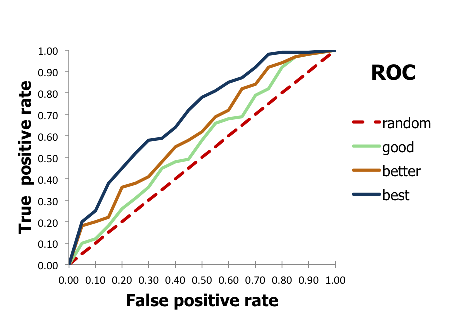

class: title, smokescreen, shelf, no-footer
background-image: url(/img/maria4.png)

# Hands-on Machine Learning
## Lecture 4

---

# What is Overfitting?


What models allow us to do is generalize from data

Different models generalize in different ways

<br>
<br>
Learning too fine details of a dataset can lead to .color-red[overfitting] --> the model predicts well the points but fails to generalize on unseen data

---

# Bias Variance Tradeoff


generalization error = systematic error (bias) + sensitivity of prediction (variance)
 
- .color-dodgerblue[Simple models under-fit]: will deviate from data (high bias) but will not be influenced by peculiarities of data (low variance).

- .color-red[Complex models over-fit]: will not deviate systematically from data (low bias) but will be very sensitive to data (high variance).

---
class: compact

# How to tell the performance of a model?

Remember data allocation!<br>
.color-deepskyblue[Training set]: Used to fit model parameters<br>
.color-darkorange[Validation set]: Used to check performance on independent data and tune hyper parameters<br>
.color-limegreen[Test set]: Final evaluation of performance after all hyper-parameters fixed

Why need a .color-darkorange[validation set] ?<br>
Evaluating different settings for estimators on test set only, there is a risk of overfitting because the parameters can be tweaked until the estimator performs optimally **-->** knowledge about the test set can “leak” into the model and evaluation metrics no longer report on generalization performance. 

- Training proceeds on the training set, then evaluation is done on the validation set
- Final evaluation can be done on the test set.


---

class: img-right, roomy

# How to tell if a Network overfits?


Look at the error vs the epoch plot. Train and validation should go down with number of epochs.

If validation error starts going up again means that the Network has started to learn too fine details of the dataset.

---

# How to deal with overfitting?

1. Reduce the number of features
  - Manually select the features to keep

--

1. Train with more data

--

1. .color-orangered[Cross-validation]

--

1. .color-limegreen[Regularization]
  - Keep all features but reduce the magnitude of parameters \\(\theta\\)
  - Use dropout

--

1. .color-orchid[Early stopping]

---

class: compact

# .color-orangered[Cross validation]


.color-orangered[Cross-Validation]: The training set is split into `k` smaller sets, then:
- A model is trained using `k-1` of the folds as training data;
- the resulting model is validated on the remaining part of the data


.color-orangered[Cross-validation] allows you to tune hyperparameters with only your original training set. This allows you to keep your test set as a truly unseen dataset for selecting your final model.


The performance measure is then the average of the values computed in the loop. 
- Computationally expensive, but does not waste too much data

---

# .color-limegreen[Regularization]: Penalizing network weights

If we have overfitting from our hypothesis, we can reduce the weight that some of the terms in our function carry by increasing their cost.

Example: 
\\[
\theta_0 + \theta_1x + \theta_2x^2 + \theta_3x^3 + \theta_4x^4 
\\]

We can penalize \\(\theta\\) terms by changing the form of the cost function to:
\\[ min^\theta \sum_{i=1}^m \left ( h(x^i,\theta) - y^i  \right )^2 + \lambda \sum_j^n \theta^2_j \\]

where \\( \lambda \\) is the regularization parameter (determines how much the costs of theta parameters are inflated)

---

class: compact

# Weight Regularization API in Keras

Keras provides a weight regularization API that allows you to add a penalty for weight size to the loss function.

Three different regularizer instances are provided:

- L1: Sum of the absolute weights
- L2: Sum of the squared weights
- L1L2: Sum of the absolute and the squared weights
The regularizers are provided under keras.regularizers with names l1, l2 and l1_l2. Each takes the regularizer hyperparameter as an argument

```python
from keras.regularizers import l2
# define model
model = Sequential()
model.add(Dense(500, input_dim=ndim, activation='relu', kernel_regularizer=l2(0.001)))
...
```

---

class: compact

# Dropout Regularization


Proposed by Srivastava, et al. in [A Simple Way to Prevent Neural Networks from Overfitting](http://jmlr.org/papers/volume15/srivastava14a/srivastava14a.pdf)

Is a technique where randomly selected neurons are ignored during training. They are “dropped-out” randomly. 
- Means that their contribution to the activation of downstream neurons is temporally removed on the forward pass and any weight updates are not applied to the neuron on the backward pass.

The effect is that the network becomes less sensitive to the specific weights of neurons. This in turn results in a network that is capable of better generalization and is less likely to overfit the training data.

---

# Tips on Regularization and Dropout 

- Use a small dropout value of 20%-50% of neurons. 
  - Too low values has minimal effect while too high result in under-learning
- Use a larger network. Gives the model more freedom to learn independent representations
- Use dropout on both input and hidden layers
- Try constraining the size of network weights using e.g max-norm regularization
  - if the norm of your weights exceeds m, it will scale your whole weight matrix by a factor that reduces the norm to m

```python
model.add(Dense(units=width, input_dim=N_input, kernel_constraint=maxnorm(3))) 
```
---

class: title

# Feature scaling
---

#Reminder

Standardization of a dataset is a common requirement for many machine learning estimators: 
- they might behave badly if the individual feature do not more or less look like standard normally distributed data

- Standardization (or Z-score normalization) features will have the properties of a Gaussian distribution with \\(\mu = 0, \sigma =1\\)
\\[
z = x_{norm} = \frac{x - \mu}{\sigma}
\\]
where \\(\mu\\) is the mean and \\( \sigma\\) is the standard deviation
---

class: col-2
# Feature scaling for train/test samples?

Scenario 1:<br>
\\(
z = \frac{x - \mu}{\sigma}
\\)<br>
\\(train, test = split(z)\\)


Scenario 2:<br>
\\(train, test = split(dataset)\\)
<br>
\\(
z^{train} = \frac{x^{train} - \mu^{train}}{\sigma^{train}}
\\)
<br>
<br>
\\(
z^{test} = \frac{x^{test} - \mu^{test}}{\sigma^{test}}
\\)

Scenario 3:<br>
\\(
z^{train} = \frac{x^{train} - \mu^{train}}{\sigma^{train}}
\\)
<br>
<br>
\\(
z^{test} = \frac{x^{test} - \mu^{train}}{\sigma^{train}}
\\)

Which one is correct??
--
<br>
Scenario 3 (the test data is “new, unseen data”)

---

class: title

# Metrics

---
# The confusion matrix


The confusion matrix is a table that is used to describe the performance of a classification model on a set of test data for which the true values are known.

There are four possible outcomes: 

- .color-green[true positive (TP)] : predicted to be positive and true value is positive
- .color-orchid[false positive (FP)] : predicted to be positive but true value is negative
- .color-dodgerblue[true negative (TN)] : predicted to be negative and true value is negative
- .color-orange[false negative (FN)] : predicted to be negative but true value is positive

---

class: img-left

# The ROC curve



The Receiver Operating Characteristic (ROC) curve is a two dimensional graph in which the false positive rate is plotted on the X axis and the true positive rate is plotted on the Y axis.

Example: Classification of Signal and Background in a physics process. Signal Efficiency vs Background Efficiency


---

# Keras Regression Metrics

On regression problems one can use:
- Mean Squared Error: mean_squared_error, MSE or mse
- Mean Absolute Error: mean_absolute_error, MAE, mae
- Mean Absolute Percentage Error: mean_absolute_percentage_error, MAPE, mape
- Cosine Proximity: cosine_proximity, cosine

```python
model.compile(loss="mse", optimizer="adam", metrics=['mse', 'mae', 'mape', 'cosine'])

plt.plot(history.history['mean_squared_error'])
plt.plot(history.history['mean_absolute_error'])
plt.plot(history.history['mean_absolute_percentage_error'])
plt.plot(history.history['cosine_proximity'])
```
---

# Keras Classification Metrics

On classification problems one can use

- .color-orchid[Binary Accuracy]
  - Implies that the threshold is 0.5, everything above 0.5 will be considered as correct
- .color-dodgerblue[Categorical Accuracy]
  - For multiclassification problems. K.argmax(y_true) takes the highest value to be the prediction and matches against the comparative set.
- .color-orange[Top k Categorical Accuracy] (requires you specify a k parameter)
  - Top-k is measured on the accuracy of the correct prediction being in the top-k predictions. 
- ...


---

# Hyper-parameter optimization

Hyper-parameter optimization is the task of finding the optimal set or training parameters that maximize the classifier performance

Most common parameters that can be optimized:
- Learning Rate
- Number of Epochs
- Hidden Layers
- Number of neurons per layer
- Activations Functions
- Optimizer

---

class: title

# Convolutional Neural Networks

---

class: compact

# What are Convolutional Neural Networks?


A great way to use deep learning to classify images is to build a convolutional neural network (CNN). Computers see images using pixels. 


Keras makes it pretty simple to build a CNN.

A convolution multiplies a matrix of pixels with a filter matrix or "kernel" and sums up the multiplication values. Then the convolution slides over to the next pixel and repeats the same process until all the image pixels have been covered.


The convolutional output for each node, over all the channels, are then passed through an activation function.


---

# Max Pooling and stride


.color-green[**Pooling**] is a “sliding window” technique, but in this case, instead of applying weights the pooling applies some sort of statistical function over the values within the window.  
- Most commonly, the function used is the **``max()``** function
- Reduces the number of parameters (is also called "down-sampling")

.color-orange[**Stride**]: the step of the filter in x,y directions, e.g [1,1]
- In max pooling, the stride is usually set so that there is no overlap between the regions
